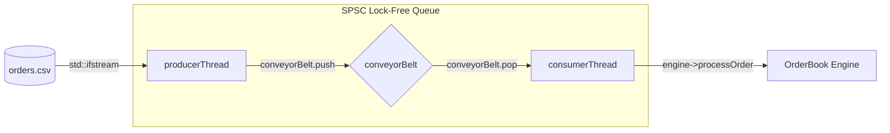
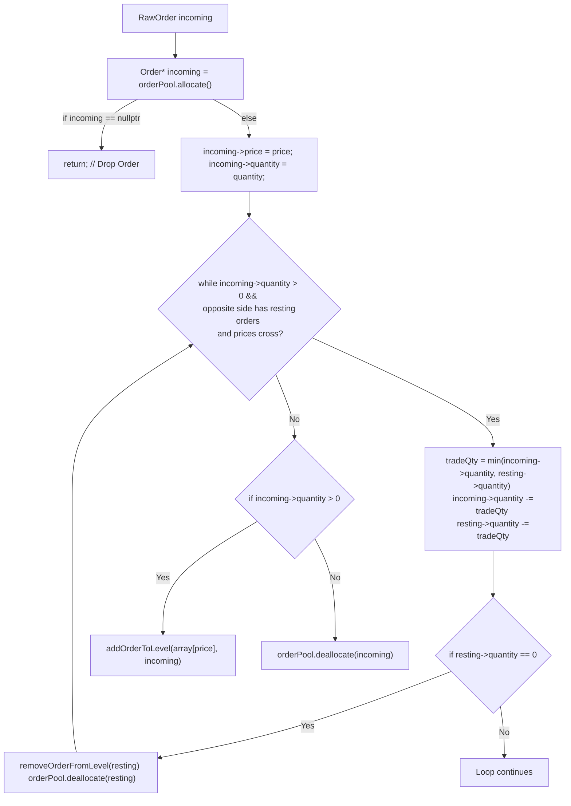

# Lithium Matcher Engine

Lithium Matcher is an ultra-low-latency, multi-threaded order matching engine written from scratch in C++20. It is designed to simulate the core infrastructure of a high-frequency trading (HFT) exchange.

By utilizing cache-line padding, lock-free concurrency, and contiguous memory object pooling, the engine achieves a peak threaded throughput of **17.2 Million orders/sec** and a core processing median latency of **28 nanoseconds** per order.


---

##  Core Architecture

The system is decoupled into two primary threads connected by a Lock-Free Single-Producer Single-Consumer (SPSC) Ring Buffer. This allows the engine to ingest orders without blocking the core matching math.

### Multi-Threaded Pipeline


### O(1) Matching Engine Logic
Instead of relying on $O(\log N)$ tree-based maps, the engine uses raw `std::array` structures indexed exactly by price, combined with an Intrusive Doubly-Linked List to guarantee allocation-free, in-place order updates. 



---

## How to Run

### Prerequisites
*   **Python 3.x** (to generate the synthetic market data)
*   **g++ / MinGW** (must support C++20 standard)

### 1. Generate Synthetic Order Data
The engine reads from a local CSV file to simulate incoming market data. Generate a 1-million-order dataset by running the included Python script:
```bash
python generate_orders.py
```
*(This will create an `orders.csv` file in your root directory).*

### 2. Compile the Engine
Compile the C++ code with strict `-O3` hardware optimizations and static linking:
```bash
g++ src\main.cpp src\OrderBook.cpp -O3 -pthread -std=c++20 -static -o lithium_matcher.exe
```

### 3. Run the Benchmark
Execute the compiled binary to launch the engine and view the hardware cycle counter (`__rdtsc`) profiling results:
```bash
.\lithium_matcher.exe
```
